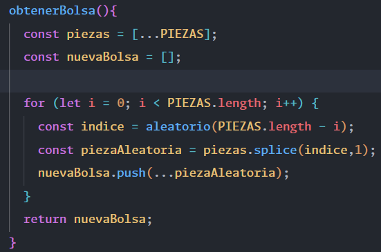
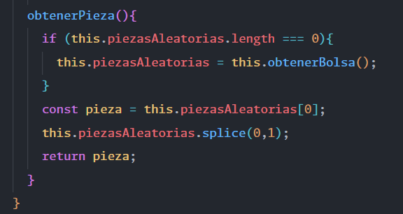
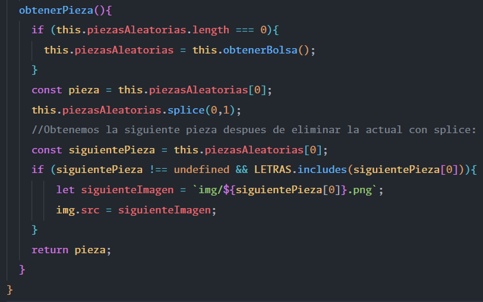
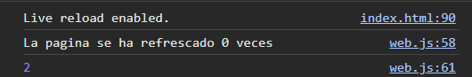

# Sitio web

🔺 [TETRIS](https://tetris-juego.vercel.app/) 🔺

# Descripción general del proyecto.
Se ha utilizado vanilla Javascript, Canvas para la animación y Tailwind para los estilos. El proyecto consiste en el tradicional juego del tetris:


# Dificultades
El juego cuenta con 2 tipos de dificultades:
* Normal
* Hard

## Hard
- Mayor velocidad
- Efecto blurr
- Controles invertidos


# Descripción de algunas funcionalidades.

## Tableros y piezas de diferentes colores.

El tetris trae una paleta de colores por defecto, pero gracias a la propiedad ``FILTER`` y al efecto *hue-rotate()* es posible hacer que cada partida tenga una apariencia diferente a la anterior.


## Bolsa virtual de piezas.

La bolsa representa un conjunto de ``PIEZAS`` de la cual se va obteniendo una ``FICHA`` hasta quedar completamente vacía. Una vez vacía, se rellena automáticamente con otro conjunto de ``PIEZAS`` aleatorias. Esto evita la repetición de una misma ficha varias veces. La única vez que se da el caso de repetición es cuando coincide la última ficha de la primera bolsa con la primera ficha de la siguiente bolsa. 


### Método que genera el array 'bolsa'.

*PIEZAS* es un array predefinido de las 7 piezas que tienen una letra y color. Ejemplo:
```js
const PIEZAS [
  ['L', 'red'],
  ['J', 'white']
]
```




En el **for** la ``i`` va aumentando y al mismo tiempo restándose en la función ``aleatorio()``. De esta manera, al disminuir el ``length`` del array por .splice(), también disminuye el número random que puede salir, evitando el 'undefined'. Ejemplo:

```sh
1º Vuelta: 
  7 - 0 = 7. Se escoge un número entre 0 y 6. 
  El array.length disminuye en 1 y pasa a 6.
```
```sh
2º Vuelta:
  7 - 1 = 6. Se escoge un número entre 0 y 5. 
  El array.length disminuye en 1 y pasa a 5. 
```
```sh
3º Vuelta: 
  7 - 2 = 5. Se escoge un número entre 0 y 4. 
  El array.length disminuye en 1 y pasa a 4. 
```

### Método que saca una ficha de la bolsa y la elimina.

Como el array 'bolsa' ya esta desordenado gracias al método anterior, basta con comprobar si quedan piezas en la bolsa y hacer un ``.splice()`` para sacar la ficha.



Este método también nos permite saber cual va ser la siguiente pieza por salir. Al eliminar la pieza 'actual' con splice, si volvemos a llamar a ``this.piezasAleatorias[0]`` obtendremos la próxima ficha.

Después podemos sacar la letra del array y concatenarla para crear una URL para la etiqueta .

```sh
Ejemplo: img.src = "img/L.png";
```




 ## Colisiones

Uno de los grandes desafíos de este juego es sin duda sus colisiones. Hay 3 tipos de colisiones que debes de manejar:
* La colisión con el final del tablero y fichas en el eje Y.
* La colisión con las fichas a tu izquierda y derecha.
* La colisión con los límites del tablero a tu izquierda y derecha. 

Para comprobar, por ejemplo, la colisión con las fichas en el eje Y tienes que ver si la posición ``actual`` de la ficha esta *rellena* y la posición ``siguiente`` es una casilla ocupada o final del tablero.


La ``rotación`` de las piezas también influye en este apartado. Por ejemplo, para calcular la posición correcta de la ``pieza "I"`` tuve que ver si en su siguiente posición **no este fuera del tablero** y las posiciones que fuera a ocupar la fila de esa ficha estuvieran **libres** (valor != 2).


 ## Animación + EventHandler

Por un lado, el juego tiene una animación que desplaza la ficha una casilla en el eje Y cada segundo. Esta animación se realiza de forma automática mediante ``requestAnimation``. Por otro lado, el jugador puede mover la ficha dentro de los límites del tablero con (A-W-S-D o las flechas). Este evento lo gestiona exclusivamente el ``addEventListener``.

Muchos de los problemas de pintado, superposición de fichas y errores de colisión ocurren por la desincronización de estos dos métodos. 


La ``solución`` para que tanto los eventos como las animaciones funcionen en armonía es usar algoritmos que calculen el tiempo entre las diferentes llamadas de forma precisa. Es decir, **no podemos depender de setTimeout()**.


Utilizaremos la clase ``Date`` y calcularemos el tiempo que pasa entre la ejecución de funciones. Por defecto, la variable *milisegundos* equivale a 1000 (1 segundo). Cuando el lapso de tiempo sea superior a 1000, se dispara el código que dibuja la ficha dentro de ``requestAnimation(animacion)``.

Además, esta fórmula también permite evitar el desplazamiento automático de la pieza mientras el jugador la mueva o rote.


## Borrar filas

Para borrar filas, lo más sencillo es comprobar que una fila tenga todos los valores iguales a '2' que es el valor que representa una casilla fija dentro de mi tablero. En este caso es posible usar la función ``every()`` que nos devuelve ``true`` si todos los valores cumplen el valor especificado y ``false`` si no es así. **La ventaja de usar este método es que, en el momento que no coincida un único valor, para de buscar coincidencias, devuelve ``false`` y pasa a la siguiente fila**.

Ejemplo:

```js
function comprobar(tablero) {
  for (let i = tablero.length - 1; i >= 0; i--) {
    const fila = tablero[i].every(casilla => casilla === 2);
    if (fila) {
      tablero.splice(i, 1);
      tablero.unshift([...nuevaFila]);
      score += 100;
      recuentoFilas++;
      i++; //Revisamos la misma fila otra vez.
    }
  }
}
```

Finalmente, para insertar una nueva fila podemos usar:
```js
const fila = [0,0,0,0,0,0,0,0,0,0]
```
u Optar por:
```js
//permite crear un array de 'x' tamaño, en este caso será igual al número de columnas especificadas del tablero.
const nuevaFila = Array.(COLUMNAS).fill(0);
``` 

## Selección aleatoria entre controles normales/invertidos

En un principio la dificultad ``HARD`` invertía los controles de movimiento hacia la derecha/izquierda para añadirle ese plus de dificultad. Sin embargo, si sigues jugando hay un momento en el que te acostumbras a la 'inversión'. 

Para evitar que esta funcionalidad solo sirva como 'sorpresa' he añadido un método adicional que, a partir de la segunda partida, seleccionará de forma aleatoria entre controles invertidos y controles tradicionales. De esta forma, el jugador nunca sabrá si la partida va a tener los controles invertidos o no hasta que empiece a jugar.

Para implementar esta funcionalidad he usado ``sessionStorage`` que permite crear variables y guardarlas como clave/valor. **Estos datos sobreviven a la recarga de página**. También existe *localStorage*, que permite una persistencia de datos superior (sobrevive a recargas de página, a la apertura de la web en diferentes pestañas del navegador e incluso al cierre del mismo). En este caso, me interesaba que solo se mantuvieran durante el refresco de página para asegurar que la primera experiencia con el modo ``HARD`` siempre fuera con los controles invertidos.

Más información [aquí](https://es.javascript.info/localstorage).

### Código del método

1. Creamos una función para sacar un número aleatorio entre 0 y 10.
2. Creamos la variable de ``session`` y la inicializamos con el valor ``0``.
3. Como todos los datos se convierten a "String" es necesario hacer un *parseInt* para aumentar el valor del ``contador``.
4. Comparamos con ``IF-ELSE`` y asignamos el evento según el número de recargas web && el número aleatorio.


### Ejemplo de 'X' recargas y selección de controles 'normales'.

### Ejemplo de 'X' recargas y selección de controles 'invertidos'.

### Primera vez


## Puntuación persistente sin BDD

El juego define 2 'mapas' de clave/valor en cada inicio/refresco de página y se mantiene la persistencia mediante ``localStorage``. El primero es un acumulador que va aumentando con cada partida y el segundo se encarga de guardar la puntuación de la partida actual. 

Como resultado, tendrías:
- partida 1, 3000 puntos
- partida 2, 0 puntos
- partida 3, 200 puntos

Después, se recorre todo el objeto y se imprime dinámicamente con Javascript en una tabla.


La razón por la que se usa el *.subString()* es porque las claves o keys no pueden contener espacios en blanco. Es decir, puedes tener partida1/250, pero no partida 1/250.

# Tareas realizadas
|                                                                       |
|-----------------------------------------------------------------------|
| ✔️ Dibujo del tablero y su matriz.                                    |
| ✔️ Implementación del método de dibujo de cada ficha.                 |
| ✔️ Descenso automático de las piezas (animación).                     |
| ✔️ Colores aleatorios en cada partida.                                |
| ✔️ Movimiento con A-W-S-D y flechas.                                  |
| ✔️ Creación de la clase 'Bolsa' para la gestión de fichas aleatorias. |
| ✔️ Gestión de colisiones.                                             |
| ✔️ Rotación de las piezas.                                            |
| ✔️ Lógica para borrar filas con casillas ocupadas.                    |
| ✔️ Score sin vista.                                                   |
| ✔️ Gestión de la velocidad.                                           |
| ✔️ Sonido.                                                            |
| ✔️ Creación de la web con Tailwind.                                   |
| ✔️ Diseño de niveles, botones de sonido, play, selección en Tailwind. |
| ✔️ Score con vista.                                                   |
| ✔️ Mostrar la siguiente ficha dentro de la bolsa.                     |
| ✔️ Dificultad HARD.                                                   |
| ✔️ Desplazamiento aleatorio                                           |
| ✔️ Diseño adaptativo a móvil                                          |
| ✔️ Game Over                                                          |
| ✔️ localStorage + tabla de puntuación                                 |

# Recursos
* [Video_ENG](https://www.youtube.com/watch?v=HEsAr2Yt2do).
* [Video_ESP](https://www.youtube.com/watch?v=36Q2g6QpSXI).

# Licencia
<p xmlns:cc="http://creativecommons.org/ns#" xmlns:dct="http://purl.org/dc/terms/"><span property="dct:title">Tetris Game</span> by <a rel="cc:attributionURL dct:creator" property="cc:attributionName" href="https://github.com/Maax3">Dmitry Poldnev</a> is licensed under <a href="http://creativecommons.org/licenses/by/4.0/?ref=chooser-v1" target="_blank" rel="license noopener noreferrer" style="display:inline-block;">CC BY 4.0</a></p>