# Sitio web

🔺 [TETRIS](https://tetris-juego.vercel.app/) 🔺

# Descripción general del proyecto.
Se ha utilizado vanilla Javascript, Canvas para la animación y Tailwind para los estilos. El proyecto consiste en el tradicional juego del tetris:


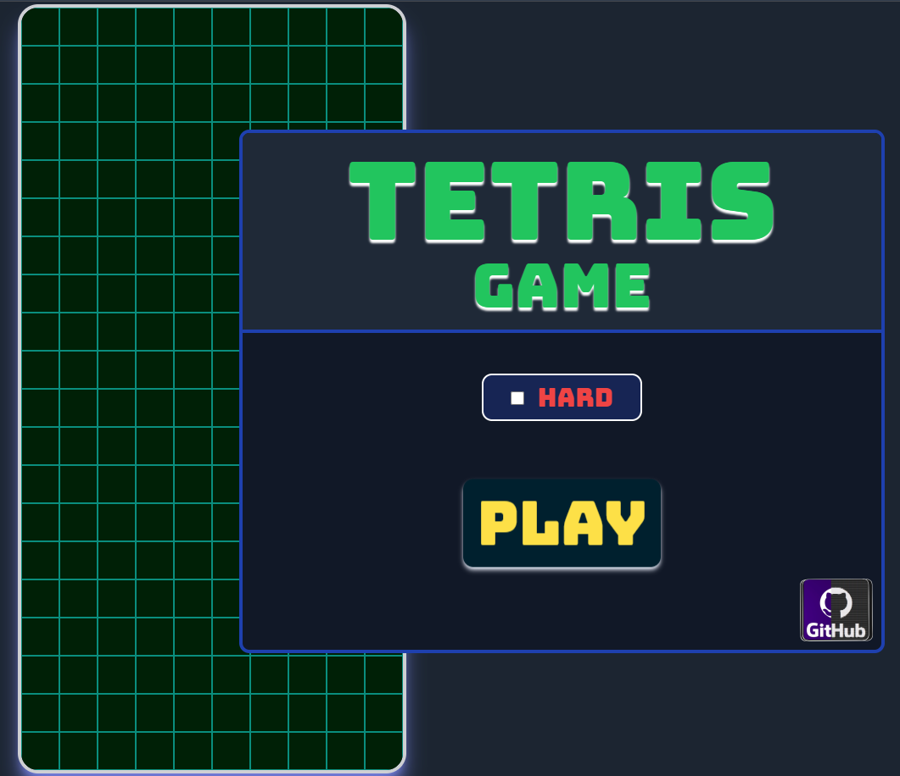

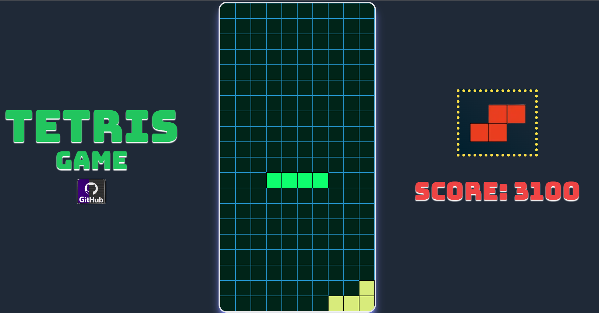

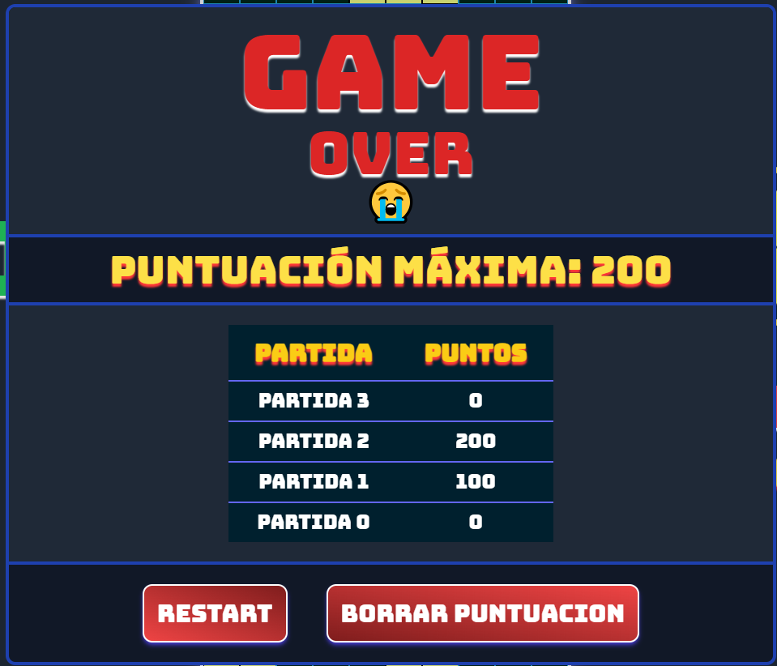


# Tareas realizadas
|                                                                       |
|-----------------------------------------------------------------------|
| ✔️ Dibujo del tablero y su matriz.                                    |
| ✔️ Funcion que dibuje cada ficha.                 |
| ✔️ Descenso automático de las piezas (animación).                     |
| ✔️ Colores aleatorios en cada partida.                                |
| ✔️ Movimiento con A-W-S-D y flechas.                                  |
| ✔️ Creación de la clase 'Bolsa' para la gestión de fichas aleatorias. |
| ✔️ Gestión de colisiones.                                             |
| ✔️ Rotación de las piezas.                                            |
| ✔️ Lógica para borrar filas con casillas ocupadas.                    |
| ✔️ Score sin vista.                                                   |
| ✔️ Gestión de la velocidad.                                           |
| ✔️ Sonido.                                                            |
| ✔️ Creación de la web con Tailwind.                                   |
| ✔️ Diseño de niveles, botones de sonido, play, selección en Tailwind. |
| ✔️ Score con vista.                                                   |
| ✔️ Mostrar la siguiente ficha dentro de la bolsa.                     |
| ✔️ Dificultad HARD.                                                   |
| ✔️ Desplazamiento aleatorio                                           |
| ✔️ Diseño adaptativo a móvil                                          |
| ✔️ Ventana del Game Over                                              |
| ✔️ localStorage + tabla de puntuación                                 |


# Dificultades
El juego cuenta con 2 tipos de dificultades:
* Normal
* Hard

## Hard
- Mayor velocidad
- Efecto blurr
- Controles invertidos


# Descripción de algunas funcionalidades.

## Tableros y piezas de diferentes colores.

El tetris trae una paleta de colores por defecto, pero gracias a la propiedad ``FILTER`` y al efecto *hue-rotate()* es posible hacer que cada partida tenga una apariencia diferente a la anterior.


## Creación del Tablero.

Para la creación de un tablero 'genérico' se ha utilizado POO (programación orientada a objetos) y CANVAS. En este caso, existe una clase llamada **Tablero**:

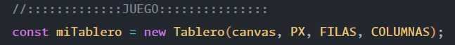
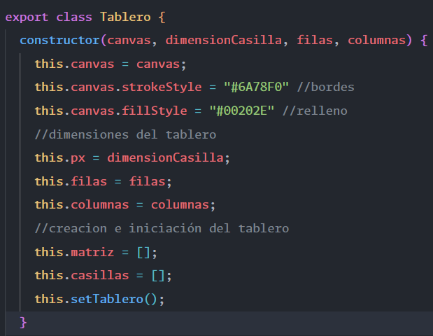

Esta clase también tiene un método llamado **setTablero()** que realiza 2 funciones:
- Por un lado, dibuja el tablero en el HTML.
- Por otro lado, crea una matriz interna que representa ese tablero.

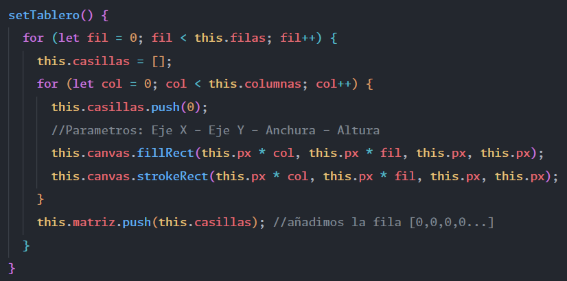


Comprobar la creación del tablero: 
```js
 1. Inspeccionar y seleccionar 'Fuentes'
 2. Crear un punto de ruptura en la linea 43 del main.js
 3. Recargar
```

## Bolsa virtual de piezas.

La bolsa representa un conjunto de ``PIEZAS`` de la cual se va obteniendo una ``FICHA`` hasta quedar completamente vacía. Una vez vacía, se rellena automáticamente con otro conjunto de ``PIEZAS`` aleatorias. Esto evita la repetición de una misma ficha varias veces. La única vez que se da el caso de repetición es cuando coincide la última ficha de la primera bolsa con la primera ficha de la siguiente bolsa. 

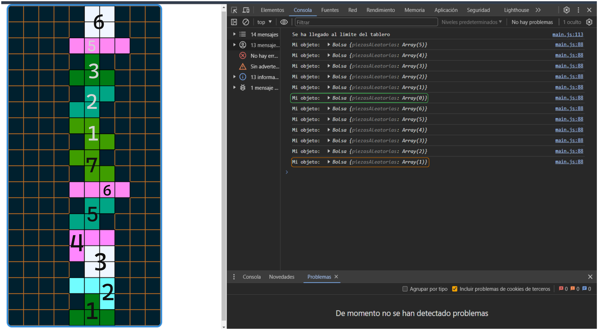

## Método que genera el array 'bolsa'.

*PIEZAS* es un array predefinido de las 7 piezas que tienen una letra y color. Ejemplo:
```js
const PIEZAS = [
  ['T', "#E71D36"],
  ['Z', "#FF44FF"],
  ['S', "#F46036"],
  ['J', "yellow"],
  ['L', "#00FF00"],
  ['I', "cyan"],
  ['O', "white"]
]
```

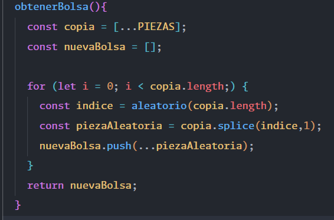

Se hace una copia de la matriz PIEZAS y a partir del **length** de 'copia' se va sacando un número aleatorio.

En la primera vuelta el número será de 0 a 6, como **splice** muta la matriz, en la siguiente vuelta tendrá una longitud de 6 y el número aleatorio será de 0 a 5.

## Método que saca una ficha de la bolsa y la elimina.

Como el array 'bolsa' ya esta desordenado gracias al método anterior, basta con comprobar si quedan piezas en la bolsa y hacer un ``.splice()`` para sacar la ficha.

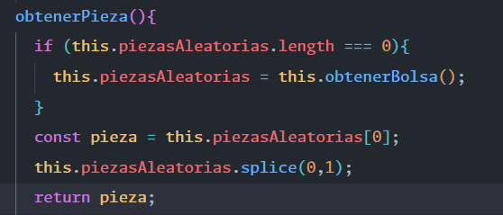

Después, he ampliado el método para saber cual va ser la siguiente pieza por salir. Al eliminar la pieza 'actual' con splice, si volvemos a llamar a ``this.piezasAleatorias[0]`` obtendremos la próxima ficha.

Asimismo, podemos sacar la letra del array y concatenarla para crear una URL para la etiqueta ``.

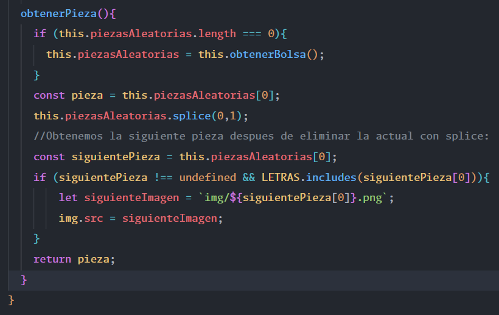

## Borrar filas

Para borrar filas, cuando una pieza colisiona con otra o el tablero, cambia su valor interno de '1' a '2'. De esta forma, es posible iterar sobre el tablero y comprobar si una fila tiene todos sus valores a '2'.

 En este caso es posible usar la función ``every()`` que nos devuelve ``true`` si todos los valores cumplen el valor especificado y ``false`` si no es así. **La ventaja de usar este método es que, en el momento que no coincida un único valor para de buscar coincidencias, devuelve ``false`` y pasa a la siguiente fila**.

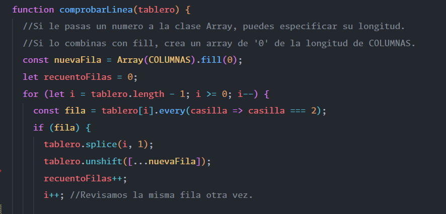

Para insertar una nueva fila también podemos usar:
```js
  const fila = [0,0,0,0,0,0,0,0,0,0]
```


## Selección aleatoria entre controles normales/invertidos

En un principio la dificultad ``HARD`` invertía los controles de movimiento hacia la derecha/izquierda para añadirle ese plus de dificultad. Sin embargo, si sigues jugando hay un momento en el que te acostumbras a la 'inversión'. 

Para evitar que esta funcionalidad solo sirva como 'sorpresa' he añadido un método adicional que, a partir de la segunda partida, seleccionará de forma aleatoria entre controles invertidos y controles tradicionales. De esta forma, el jugador nunca sabrá si la partida va a tener los controles invertidos o no hasta que empiece a jugar.

Para implementar esta funcionalidad he usado ``sessionStorage`` que permite crear variables y guardarlas como clave/valor. **Estos datos sobreviven a la recarga de página**. También existe *localStorage*, que permite una persistencia de datos superior (sobrevive a recargas de página, a la apertura de la web en diferentes pestañas del navegador e incluso al cierre del mismo). En este caso, me interesaba que solo se mantuvieran durante el refresco de página para asegurar que la primera experiencia con el modo ``HARD`` siempre fuera con los controles invertidos.

Más información [aquí](https://es.javascript.info/localstorage).

## Código del método

1. Creamos una función para sacar un número aleatorio entre 0 y 10.
2. Creamos la variable de ``session`` y la inicializamos con el valor ``0``.
3. Como todos los datos se convierten a "String" es necesario hacer un *parseInt* para aumentar el valor del ``contador``.
4. Comparamos con ``IF-ELSE`` y asignamos el evento según el número de recargas web && el número aleatorio.

*Esta función se ejecuta después de seleccionar el modo hard y jugar una partida.*

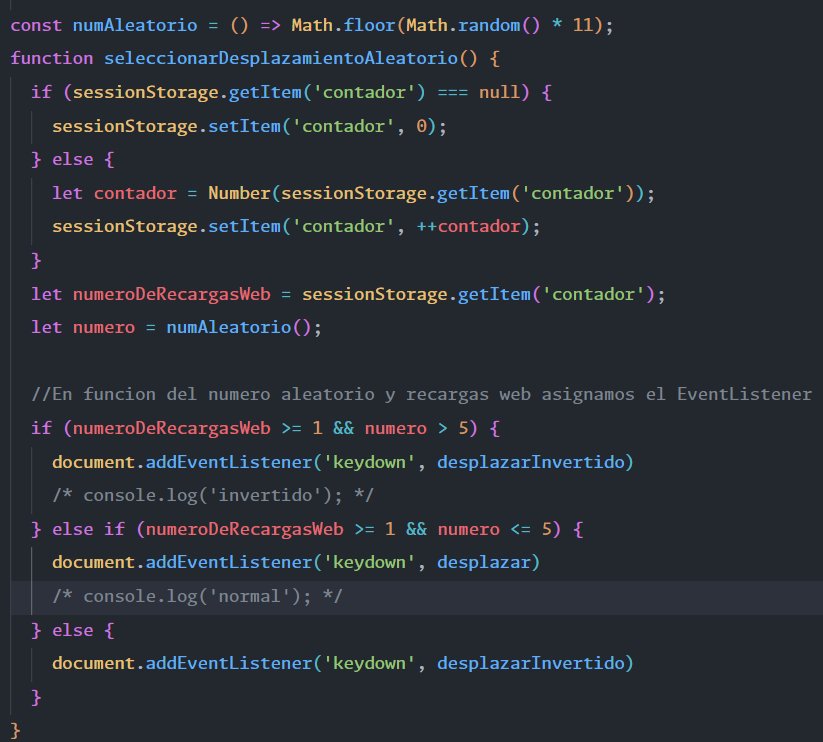

### Ejemplo de 'X' recargas y selección de controles 'normales'.
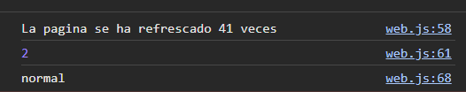
### Ejemplo de 'X' recargas y selección de controles 'invertidos'.
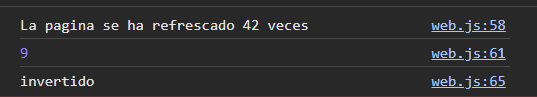


## Puntuación persistente sin BDD

El juego define 2 variables de ``localStorage`` para guardar el numero de partidas y la puntuación de la partida actual. 

Al unir ambos, tendriamos el numero de la partida y los datos (puntuación) de la misma. Ejemplo:
- partida 1, 3000 puntos
- partida 2, 0 puntos
- partida 3, 200 puntos

Después, se recorre todo el objeto y se imprime dinámicamente con Javascript en una tabla.

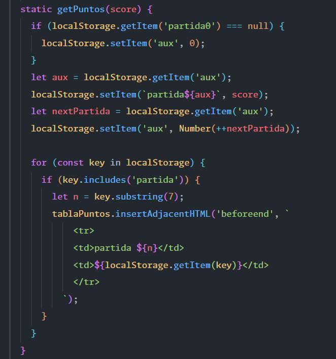

La razón por la que se usa el *.subString()* es porque las claves o keys no pueden contener espacios en blanco. Es decir, puedes tener partida1, pero no partida 1.


 ## Colisiones

Uno de los grandes desafíos de este juego es sin duda sus colisiones. Hay 3 tipos de colisiones que debes de manejar:
* La colisión con el final del tablero y fichas en el eje Y.
* La colisión con las fichas a tu izquierda y derecha.
* La colisión con los límites del tablero a tu izquierda y derecha. 

Para comprobar, por ejemplo, la colisión con las fichas en el eje Y tienes que ver si la posición ``actual`` de la ficha esta *rellena* y la posición ``siguiente`` es una casilla ocupada o final del tablero.

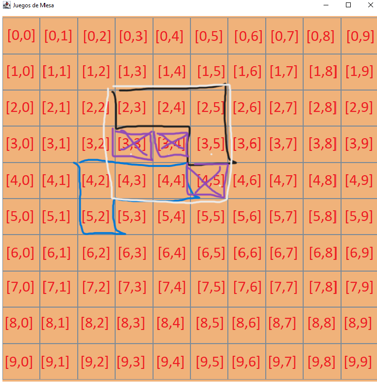

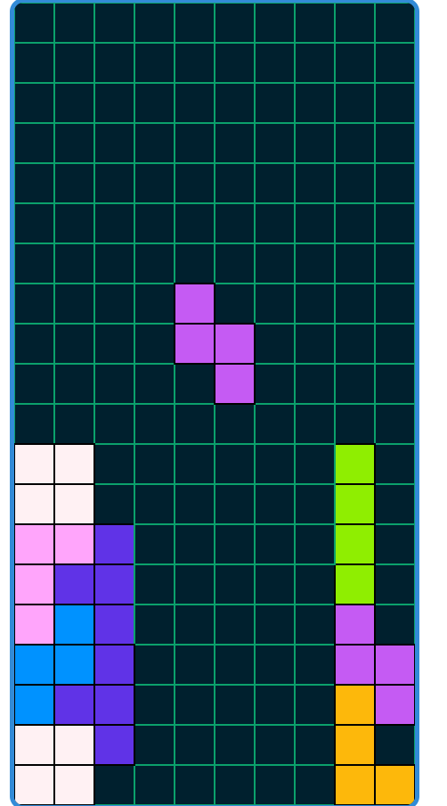

La ``rotación`` de las piezas también influye en este apartado. Por ejemplo, para calcular la posición correcta de la ``pieza "I"`` tuve que ver si en su siguiente posición **no este fuera del tablero** y las posiciones que fuera a ocupar la fila de esa ficha estuvieran **libres** (valor != 2).

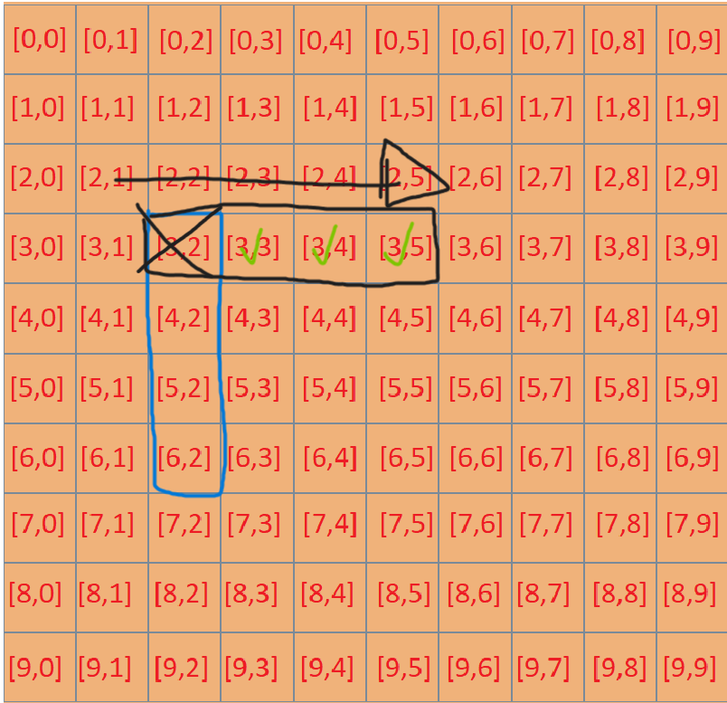

 ## Animación + EventHandler

Por un lado, el juego tiene una animación que desplaza la ficha una casilla en el eje Y cada segundo. Esta animación se realiza de forma automática mediante ``requestAnimation``. Por otro lado, el jugador puede mover la ficha dentro de los límites del tablero con (A-W-S-D o las flechas). Este evento lo gestiona exclusivamente el ``addEventListener``.

Muchos de los problemas de pintado, superposición de fichas y errores de colisión ocurren por la desincronización de estos dos métodos. 

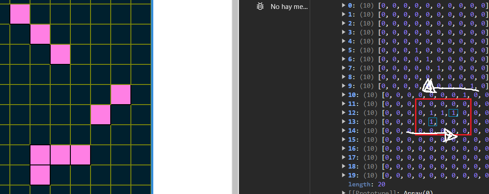

La ``solución`` para que tanto los eventos como las animaciones funcionen en armonía es usar algoritmos que calculen el tiempo entre las diferentes llamadas de forma precisa. Es decir, **no podemos depender de setTimeout()**.


Utilizaremos la clase ``Date`` y calcularemos el tiempo que pasa entre la ejecución de funciones. 

Además, esta fórmula también permite evitar el desplazamiento automático de la pieza mientras el jugador la mueva o rote.

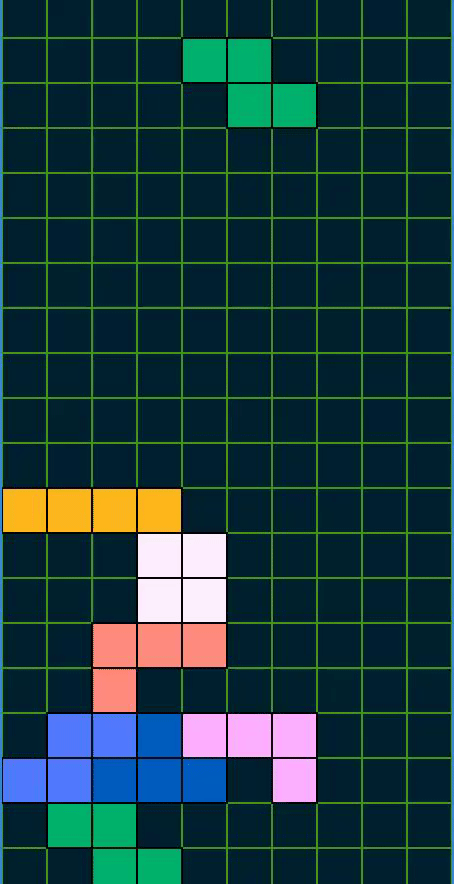

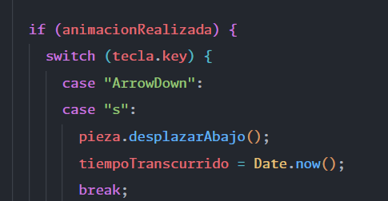


# Recursos
* [Video_ENG](https://www.youtube.com/watch?v=HEsAr2Yt2do).
* [Video_ESP](https://www.youtube.com/watch?v=36Q2g6QpSXI).

# Licencia
<p xmlns:cc="http://creativecommons.org/ns#" xmlns:dct="http://purl.org/dc/terms/"><span property="dct:title">Tetris Game</span> by <a rel="cc:attributionURL dct:creator" property="cc:attributionName" href="https://github.com/Maax3">Dmitry Poldnev</a> is licensed under <a href="http://creativecommons.org/licenses/by/4.0/?ref=chooser-v1" target="_blank" rel="license noopener noreferrer" style="display:inline-block;">CC BY 4.0</a></p>